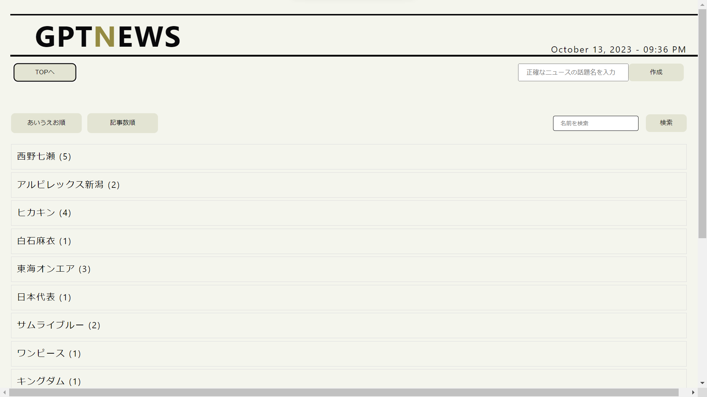

# GPTNEWS

GPTNEWSとは、LahngChainとplaywrightを用いて、自動で記事を生成するサービスです。

デプロイは行いましたがバックエンドをHerokuで行っていて、バックエンドでの処理がHerokuの時間内に終わらないため、現状はエラーが起きてしまっています。

ローカルにcloneして使用することをお勧めします。
主に.envの中身を変更することで、自分の環境で使用することができます。

11/6のOpenAIのカンファレンスにより、動く可能性があります。
URL: https://news-from-gpt.vercel.app/

ホーム画面：

記事生成画面：
